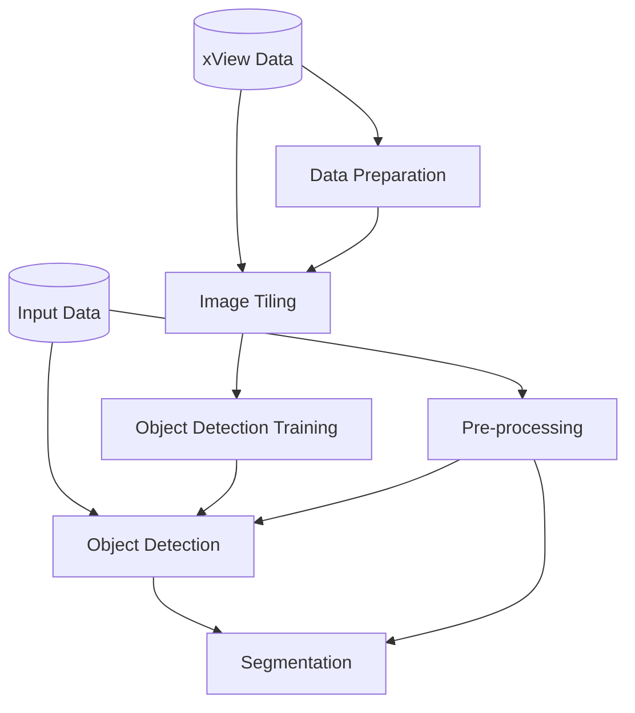

# AerialML
This project aims to detect and segment buildings (and vehicles/aircraft as desired) from aerial imagery.

Specifically, the library is pipeline composed of the following steps:

Training:
- Load a training set of data - xView.
- Tile the training set images, increasing the pixels/meter downstream.
- Train a YOLOv8 model on this dataset to detect major types of objects.

Inference:
- Conduct image preprocessing to optimize input data quality (enhance contrast).
- Detect major types of objects such as buildings, cars or airplanes on our test dataset.
- Employ Segment Anything Model as a "prompt-based" segmentation technique.
- Generate a GeoJSON file containing polygon representations of the detected the object footprints.
- Create new images with the object footprints superimposed for visualization.

The pipeline looks like this:



## Installation
To use the code in this project, you'll need to create a Python environment, clone the repository and download the data using DVC.
```
conda create -n <envname> python=3.10
conda activate <envname>

pip install poetry
poetry install

git clone https://github.com/SaraR-1/AerialMI.git
dvc pull
```

Before using DVC, you'll first need to setup your AWS credential. To do so, create a file at `~/.aws/credentials`. The content of the file should look like this:
```
[default]
aws_access_key_id=foo
aws_secret_access_key=bar
```
Where:
- aws_access_key_id - The access key for your AWS account.
- aws_secret_access_key - The secret key for your AWS account.

Please send me an email for these credentials.

## Running the Code

To run the entire pipeline you can use DVC as:
```
dvc repro
```
This will reproduce the complete (or partial) pipeline by running its stages as needed in the correct order.

